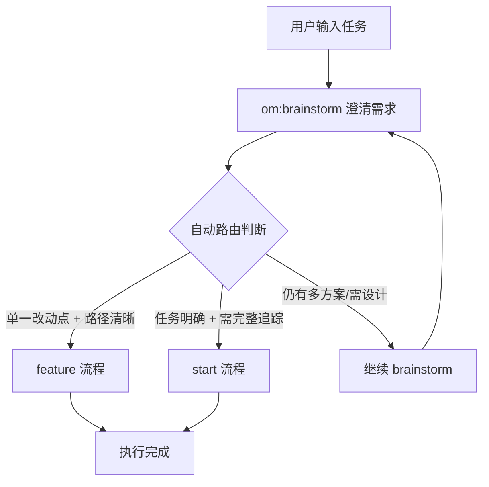
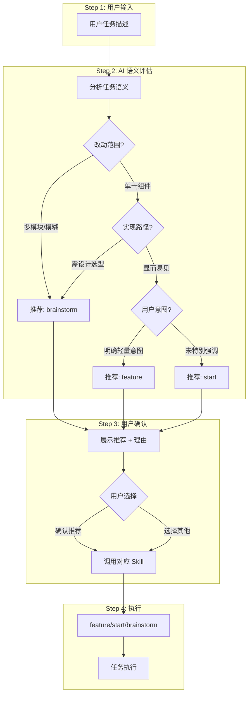

# OpenMatrix v0.2.17~v0.2.19 更新：智能路由自动判断

本次更新重点优化了任务路由机制，让 OpenMatrix 更智能地判断任务应该走哪个流程。

## 核心更新

### 1. om:brainstorm 澄清后自动路由

**之前的问题**：头脑风暴澄清需求后，用户还需要手动选择下一步流程，造成二次选择。

**现在的改进**：AI 根据澄清结果自动判断路由，直接进入对应执行流程。



**路由判断规则**：

| 澄清结果 | 路由 | 理由 |
|---------|------|------|
| 单一改动点 + 实现路径清晰 | feature | 轻量追踪即可 |
| 任务明确 + 需完整追踪 | start | 需质量门禁和验收 |
| 仍有多方案/需进一步设计 | 继续 brainstorm | 尚未达到可执行状态 |

---

### 2. om 入口改为 AI 推荐 + 用户确认

**之前的问题**：用户输入任务后，直接展示三个流程选项让用户选择，没有引导。

**现在的改进**：AI 先分析任务语义给出推荐路由和理由，用户确认后执行。


**判断原则（不明确优先澄清）**：

**优先级顺序：brainstorm > start > feature**

- 任务不明确时优先头脑风暴，先澄清再执行
- 标准流程需要"任务足够明确"，不是兜底选项
- 小需求需要用户明确表达轻量意图，不是短描述就判定

**判断维度**：

| 维度 | feature | start | brainstorm |
|------|---------|-------|------------|
| 改动范围 | 单一组件/文件 | 明确模块边界 | 模糊/多模块协同 |
| 实现路径 | 显而易见 | 清晰可执行 | 需要设计/选型 |
| 上下文充分度 | 用户已说明足够 | 描述完整清晰 | 缺少关键信息 |
| 用户意图 | 明确表达"快速/简单" | 未特别强调 | 可能需要澄清 |

---

### 3. 小需求判断改为语义优先

**之前的问题**：仅根据字数判断是否为小需求（≤100字），容易误判。

**现在的改进**：语义优先判断，字数仅作辅助参考。

**判断示例**：

| 任务描述 | 字数 | 语义判断 | 推荐路由 |
|---------|------|----------|---------|
| "给列表页添加搜索按钮" | 12字 | 用户意图明确，改动单一 | feature |
| "小改动：调整按钮颜色" | 9字 | 用户表达轻量意图 | feature |
| "实现用户登录功能" | 8字 | 需澄清登录方式、认证方案 | brainstorm |
| "添加 API 接口返回用户列表" | 12字 | 实现路径清晰，无需澄清 | start |
| "从零搭建后台管理系统" | 10字 | 需设计架构、模块划分 | brainstorm |
| "优化首页加载速度" | 8字 | 缺上下文：瓶颈在哪？目标指标？ | brainstorm |

---

## 使用方式

### 基本使用

```bash
/om 给列表页添加搜索按钮       # AI 推荐小需求流程，用户确认
/om 实现用户登录功能           # AI 推荐澄清流程，用户确认
/om 添加 API 接口返回用户列表  # AI 推荐标准流程，用户确认
/om 从零搭建后台系统           # AI 推荐设计流程，用户确认
```

### 跳过推荐直接进入流程

```bash
/om:feature 给按钮加点击事件   # 直接进入小需求流程
/om:start 添加用户管理模块     # 直接进入标准流程
/om:brainstorm 登录功能怎么设计 # 直接进入澄清/设计流程
```

### 查看帮助

```bash
/om                            # 显示帮助信息和所有命令
```

---

## 适用场景

| 场景 | 推荐流程 | 触发信号 |
|------|---------|---------|
| 单一小改动 | feature | 用户表达"简单/快速"，改动单一 |
| 明确的功能开发 | start | 实现路径清晰，无需澄清 |
| 需求不明确 | brainstorm | 缺少关键信息，有多种实现方案 |
| 从零搭建系统 | brainstorm | 需要架构规划、模块划分 |
| 技术选型问题 | brainstorm | 涉及多种方案需要权衡 |

---

## 路由判断流程图



---

## 与之前版本对比

| 特性 | v0.2.16 | v0.2.17~v0.2.19 |
|------|---------|-----------------|
| om 入口 | 直接展示选项 | AI 推荐 + 用户确认 |
| brainstorm 后 | 用户二次选择 | 自动路由判断 |
| 小需求判断 | 字数优先（≤100字） | 语义优先 |
| 路由推荐 | 无 | 有推荐理由 |

**改进效果**：

1. **减少用户决策负担**：AI 给出推荐理由，用户只需确认
2. **避免二次选择**：brainstorm 澄清后自动进入执行流程
3. **更准确的判断**：语义分析比字数统计更可靠

---

## 安装升级

```bash
# 全局安装最新版本
npm install -g openmatrix@latest

# 或使用 npx
npx openmatrix@latest

# 检查版本
openmatrix --version
# 应显示: 0.2.19 或更高
```

---

## 下一步计划

- [ ] VSCode 扩展开发
- [ ] CI/CD 集成优化
- [ ] 多语言 SDK (Python, Go)
- [ ] 可视化仪表板

---

**如果觉得有用，请给个 Star！**

[GitHub](https://github.com/bigfish1913/openmatrix) | [官方文档](https://matrix.laofu.online/docs/)