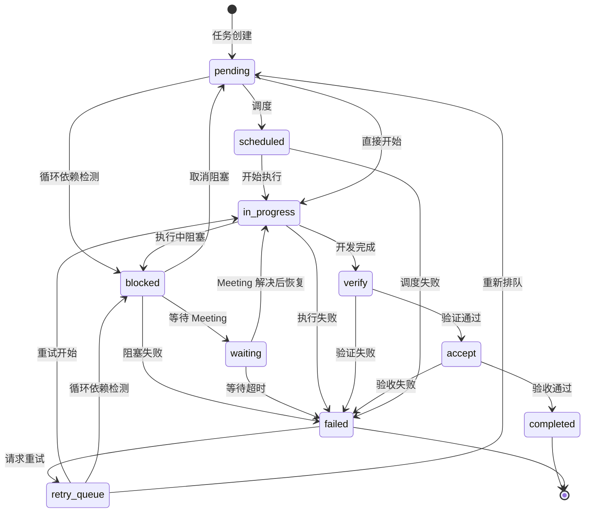

# OpenMatrix v0.2.22 更新：任务阻塞机制

本次更新引入了**任务阻塞机制**，通过新增 `blocked` 状态和循环依赖自动检测，让任务编排更加健壮。

## 🚫 任务阻塞机制

### 什么是阻塞机制？

在任务编排过程中，某些任务可能因为外部依赖未就绪、资源冲突或循环依赖等原因无法继续执行。阻塞机制允许将这些任务标记为 `blocked` 状态，跳过它们继续执行其他任务，最后统一处理。

### 阻塞场景

| 场景 | 说明 | 处理方式 |
|------|------|---------|
| 循环依赖 | A 依赖 B，B 依赖 A | 自动检测并标记为 blocked |
| 外部依赖 | 等待第三方 API/服务 | 标记 blocked → waiting |
| 资源冲突 | 需要用户决策 | 创建 Meeting 等待处理 |
| 环境缺失 | 缺少必要配置 | 提示用户提供信息 |

---

## 🔄 状态转换规则（新增 blocked 状态）

### 完整状态转换图



### 状态说明

| 状态 | 描述 | 可转换目标 |
|------|------|-----------|
| `pending` | 等待执行 | scheduled, in_progress, blocked |
| `scheduled` | 已调度，等待 Agent | in_progress, failed |
| `in_progress` | 执行中 | verify, blocked, failed |
| `blocked` | 被阻塞 | waiting, pending, failed |
| `waiting` | 等待确认/Meeting | in_progress, failed |
| `verify` | 验证中 | accept, failed |
| `accept` | 验收中 | completed, failed |
| `completed` | 已完成 | - |
| `failed` | 失败 | retry_queue |
| `retry_queue` | 重试队列 | pending, in_progress, blocked |

---

## 🔍 循环依赖自动检测

### 检测机制

OpenMatrix 使用深度优先搜索（DFS）算法自动检测任务依赖中的循环引用：

```typescript
// 检测到循环依赖时自动标记为 blocked
// 示例: TASK-001 → TASK-002 → TASK-003 → TASK-001
```

### 工作流程

```
任务调度
    │
    ▼
检测依赖关系 ──→ 发现循环 ──→ 标记 blocked
    │                              │
    ▼                              ▼
无循环，继续执行              记录循环路径
    │                              │
    ▼                              ▼
正常执行任务                  创建 Meeting
                                   │
                                   ▼
                              用户处理决策
                                   │
                                   ▼
                              解除阻塞或跳过
```

### 性能优化

- **缓存机制**: 30 秒内重复检测使用缓存结果
- **增量计算**: 仅在任务列表变化时重新检测
- **哈希校验**: 使用任务 ID + 状态 + 依赖组合作为缓存键

---

## 📋 使用方式

### 自动阻塞（循环依赖）

当系统检测到循环依赖时，会自动将相关任务标记为 `blocked`：

```bash
# 系统自动检测并记录
[Scheduler] 检测到循环依赖: TASK-001 → TASK-002 → TASK-001
[Scheduler] 任务 TASK-001 已标记为 blocked
[Scheduler] 任务 TASK-002 已标记为 blocked
```

### 手动阻塞

在执行过程中遇到外部依赖时，可以手动标记任务为阻塞状态：

```bash
# Skill 层调用
/om:meeting  # 查看所有阻塞任务
```

### 处理阻塞任务

使用 Meeting 机制统一处理所有阻塞任务：

```bash
/om:meeting
# 显示所有 blocked/waiting 状态的任务
# 提供选项：提供信息 / 选择方案 / 跳过任务
```

---

## 🎯 适用场景

### 场景一：循环依赖

```
TASK-001: 实现用户服务
    └─ 依赖 TASK-002

TASK-002: 实现认证服务
    └─ 依赖 TASK-001

# 自动检测并阻塞
```

### 场景二：外部依赖等待

```
TASK-003: 集成支付系统
    └─ 需要第三方 API Key

# 标记为 blocked → 等待用户提供 API Key
```

### 场景三：技术决策

```
TASK-004: 选择数据库方案
    └─ 需要用户决策: PostgreSQL vs MongoDB

# 创建 Meeting 等待用户选择
```

---

## 🔗 与 Meeting 机制的关系

### 协作流程

```
┌─────────────────────────────────────────────────────────────┐
│                      执行阶段                                │
├─────────────────────────────────────────────────────────────┤
│                                                             │
│  TASK-001 ✅ ──→ TASK-002 🚫 阻塞 ──→ 创建 Meeting         │
│                       │                  │                 │
│                       ▼                  ▼                 │
│  TASK-003 ✅ ──→ TASK-004 ✅ ──→ 跳过 ↷ 继续               │
│                                               │             │
└───────────────────────────────────────────────┼─────────────┘
                                                │
                                                ▼
┌─────────────────────────────────────────────────────────────┐
│                    Meeting 处理阶段                          │
├─────────────────────────────────────────────────────────────┤
│                                                             │
│  ┌─────────────────────────────────────────────────────┐   │
│  │ 📋 阻塞任务列表                                       │   │
│  ├─────────────────────────────────────────────────────┤   │
│  │ [1] TASK-002: 循环依赖                               │   │
│  │     循环路径: TASK-002 → TASK-001 → TASK-002        │   │
│  │     💡 修改依赖 / ⏭️ 跳过任务                         │   │
│  └─────────────────────────────────────────────────────┘   │
│                           │                                 │
│                           ▼                                 │
│              用户处理 → 解除阻塞 → 重新执行                  │
│                                                             │
└─────────────────────────────────────────────────────────────┘
```

### 状态流转

| 状态 | 触发条件 | 下一步 |
|------|---------|--------|
| `blocked` | 检测到循环依赖 | 等待 Meeting 处理 |
| `blocked` → `waiting` | 需要 Meeting 决策 | 等待用户响应 |
| `waiting` → `in_progress` | Meeting 解决 | 恢复执行 |
| `blocked` → `failed` | 无法解决 | 标记失败 |
| `blocked` → `pending` | 取消阻塞 | 重新排队 |

---

## 📦 安装升级

```bash
# 全局安装最新版本
npm install -g openmatrix@latest

# 或使用 npx
npx openmatrix@latest start "你的任务"
```

---

## 📝 下一步计划

- [ ] VSCode 扩展开发
- [ ] CI/CD 集成优化
- [ ] 多语言 SDK (Python, Go)
- [ ] 可视化仪表板

---

**如果觉得有用，请给个 ⭐ Star！**

[GitHub](https://github.com/bigfish1913/openmatrix) | [官方文档](https://matrix.laofu.online/docs/)