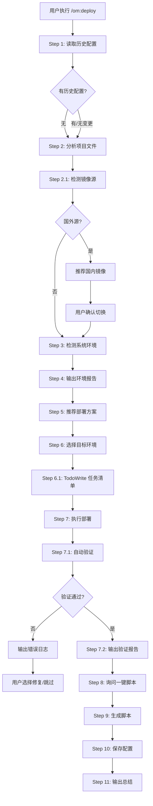

# OpenMatrix v0.2.23 更新：部署体验优化

本次更新聚焦 `/om:deploy` 命令，针对国内开发者面临的网络问题进行了专项优化，同时引入 TodoWrite 任务追踪机制，让部署进度一目了然。

## 🌐 慢源检测与国内镜像推荐

**自动检测包管理器镜像源，智能推荐国内镜像**

### 检测范围

| 包管理器 | 国外源 | 国内镜像 |
|---------|--------|---------|
| npm/yarn/pnpm | registry.npmjs.org | npmmirror.com (淘宝) |
| pip | pypi.org | pypi.tuna.tsinghua.edu.cn (清华) |
| Docker | docker.io | mirror.ccs.tencentyun.com (腾讯) |
| Go | proxy.golang.org | goproxy.cn |
| Rust/Cargo | crates.io | rsproxy.cn |
| Maven | repo.maven.apache.org | maven.aliyun.com |

### 工作流程

```
Step 2.1: 检测依赖源
    ↓
读取镜像配置 (npm config / pip config / go env 等)
    ↓
AI 分析源地址
    ├─ 国内源 → 继续部署
    └─ 国外源 ↓
展示推荐选项
    ↓
用户确认切换
    ↓
执行切换命令
```

### 使用示例

```bash
/om:deploy

# AI 自动检测并输出：
┌─────────────────────────────────────────────────────────┐
│ 镜像源                                                   │
├─────────────────────────────────────────────────────────┤
│ 检测到 npm 使用官方源（registry.npmjs.org）              │
│ 国内访问较慢。是否切换到国内镜像？                       │
│                                                         │
│ [1] 切换到淘宝镜像 (推荐)                                │
│     npmmirror.com，同步延迟 < 10 分钟                    │
│ [2] 保持不变                                             │
│ [3] 使用其他镜像                                         │
└─────────────────────────────────────────────────────────┘

# 选择 [1] 后自动执行：
npm config set registry https://registry.npmmirror.com
```

### Dockerfile apt 源替换

如果项目包含 Dockerfile，AI 会读取并检测 apt 源：

```dockerfile
# 原始 Dockerfile（国外源）
RUN apt-get update

# AI 优化后（国内源）
RUN sed -i 's/archive.ubuntu.com/mirrors.aliyun.com/g' /etc/apt/sources.list
RUN apt-get update
```

---

## 📋 TodoWrite 逐条追踪

**部署步骤多时，用 TodoWrite 管理每个步骤的状态**

### 任务清单示例

部署时自动生成任务清单，用户可实时看到进度：

```markdown
## 部署任务清单

- ✅ 切换 npm 源到淘宝镜像
- ✅ 构建 Docker 镜像
- ⏳ 正在启动容器...
- ⏸️ 验证部署：容器状态
- ⏸️ 验证部署：端口监听
- ⏸️ 验证部署：HTTP 连通
- ⏸️ 生成 Taskfile.yml 一键脚本
- ⏸️ 保存部署配置
```

### 动态生成规则

任务清单根据实际情况动态生成：

| 场景 | 任务清单内容 |
|------|-------------|
| 检测到慢源 | + 源切换任务 |
| 需要生成 Dockerfile | + 生成配置任务 |
| 多服务部署 | 每个服务一条任务 |
| 选择生成脚本 | + 脚本生成任务 |
| Web 项目 | + 浏览器验证任务 |

### 执行规则

- 每次只执行一条任务
- 完成后立即标记 `completed`
- 失败时停止，输出错误信息
- 用户可清晰看到整体进度

---

## 🚀 完整部署流程



---

## 📝 使用方式

### 基本命令

```bash
/om:deploy              # 自动分析 → 推荐方案 → 执行 → 生成脚本
/om:deploy local        # 直接指定本地环境
/om:deploy prod         # 直接指定生产环境
```

### 部署报告示例

```markdown
## ✅ 部署验证报告

**服务状态**: 运行中 (Up 2 minutes)
**端口**: 3000 已监听
**HTTP 连通**: http://localhost:3000/ → 200 OK
**健康检查**: /health → 200 OK

### 验证清单
- ✅ 容器/进程正常运行
- ✅ 端口 3000 已监听
- ✅ HTTP 请求返回 200
- ✅ 页面可正常访问

### 访问地址
http://localhost:3000/

### 快捷命令
- 查看日志: docker logs -f my-app
- 停止服务: docker stop my-app
- 重启服务: docker restart my-app
```

---

## 🎯 适用场景

| 场景 | 说明 |
|------|------|
| 国内开发者 | npm/pip/Go 等源下载慢，自动推荐国内镜像 |
| 复杂部署 | 多步骤部署，TodoWrite 清晰展示进度 |
| Docker 部署 | Dockerfile apt 源自动优化 |
| CI/CD | 自动验证部署结果，确保服务可用 |

---

## 📦 安装升级

```bash
# 全局安装最新版本
npm install -g openmatrix@latest

# 或使用 npx
npx openmatrix@latest deploy

# 验证安装
openmatrix --version
```

---

## 📝 下一步计划

- [ ] VSCode 扩展开发
- [ ] CI/CD 集成优化
- [ ] 多语言 SDK (Python, Go)
- [ ] 可视化仪表板

---

**如果觉得有用，请给个 Star！**

[GitHub](https://github.com/bigfish1913/openmatrix) | [官方文档](https://matrix.laofu.online/docs/)